# RoadHouse BJJ

## Introduction
This is a project I have created for my first assignment in HTML and CSS. The project is for a Brazilian JiuJitsu club called Roadhhouse BJJ. The website is to allow interested parties, current and potential members to find  relevant information about the gym, where it's located and when the classes are along with more information regarding the gym itself. The webpage is fully responsive for devices from 300px to large monitors 1200px+.

You can access the page live via github pages on the url below.
https://mickjitsu.github.io/roadhouse_BJJ/

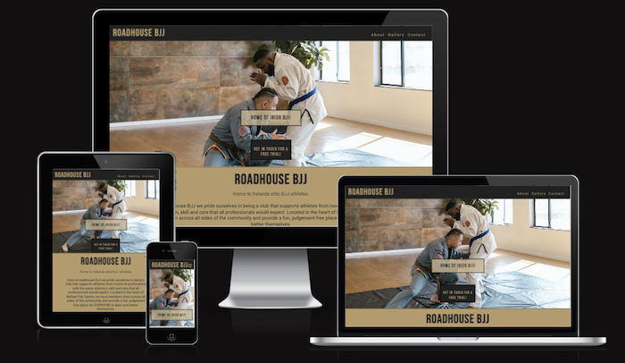

## Table of Contents
- [Introduction](#introduction)
- [User Experience](#user-experience)
  - [User Stories](#user-stories)
- [Design](#design)
  - [Colour Scheme](#colour-scheme)
  - [Typography](#typography)
  - [Imagery](#imagery)
  - [Wireframes](#wireframes)
- [Features](#features)
  - [Existing Features](#existing-features)
  - [Features to be Added](#features-to-be-added)
- [Testing](#testing)
  - [Validation of Code](#validation-of-code)
  - [Manual Testing](#manual-testing)
  - [Bug resolutions](#bugs)
- [Technologies Used](#technologies-used)
- [Deployment](#deployment)
- [Credits](#credits)
- [Acknowledgements](#acknowledgements)

## User Experience
### User Stories
-User Goals

- Navigature clearly and effectively across the site
- Find specific information they require
- Read about the class schedule and equipment
- Get in touch via our contact page.

Site Owner Goals

- Ensure the website is seamless for the user
- Ensure the user can find exactly what they need
- Promote the gym and the sport in general
- Allow for possible members to contact us
- Keep all interested parties up to date with relevant information

## Design
### Colour Scheme
I used the website color-hex.com to find an appropriate colour scheme and decided on the shade and colour
#BEA477. Along with this I chose a secondary colour #CEBB9A for certain sections, along with inverting the text colour
#252525 for the header and footer. You can see a contrast grid of all colours used throughout the website, with a rating of AA or AAA for each colour palette used.

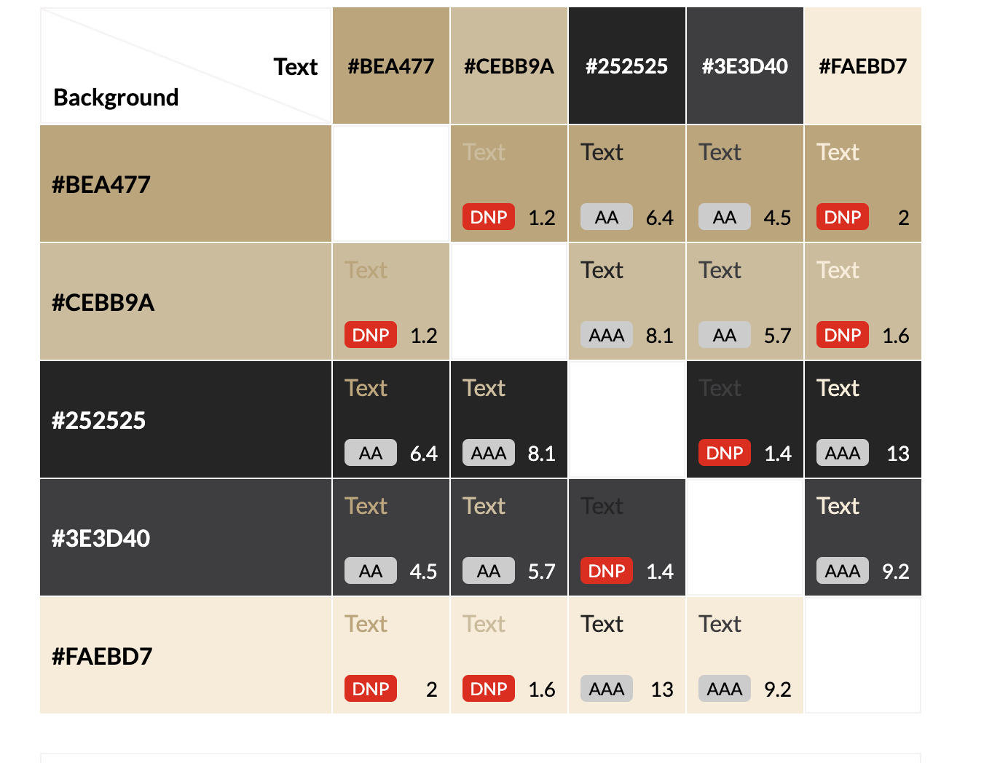

### Typography
I chose to stick with a sans-serif font type for the entirety of the webpage as it is very clear and easy to read for all users. Body font was 'Roboto', while headings were 'Bebas Neue' of the sans-serif family.
### Imagery
The entirety of my gallery page was found from pexels.com along with the index hero image and the class photo page.owever many other images were used primarily from websites found on google. The coach images were from sherdog.com, a popular MMA site. The about hero image was from bjjfanactics.com and the gym photo from fittinsider.com.

I understand in a real website I would need to have image rights for images used or use free stock sites like pexels or others to ensure I am not breaking any copyright laws.

### Wireframes
I was unable to install balsamiq wireframing tool due to restrictions on the computer I am using, so I opted for a free tool online wireframe.cc . Although it was more difficult to use and didn't allow me plan as effectively as I would have liked, I made some rough wireframes for each page.

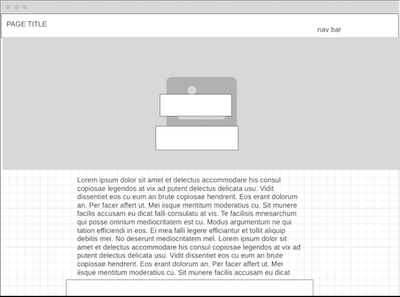
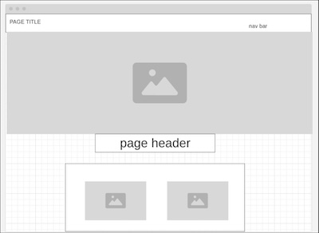
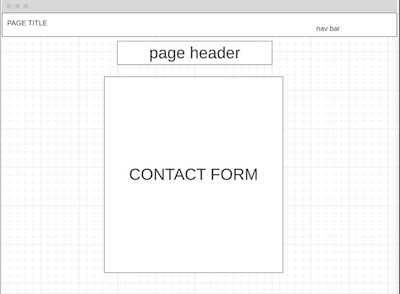

## Features

### Responsive Navigation Bar toggle
This code was taken from the LoveRunning course to enable this feature using only CSS and HTML and is visible under the nav bar styles on styles.css page.

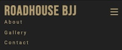

### Responseive map for directions
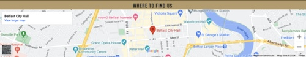

### Footer with working social mediahyperlinks
This code was also taken from the LoveRunning course for ease of use.

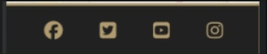

### Heading on index page with hyperlink to contact page

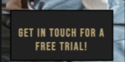

### Working contact form which redirects to a thank you page

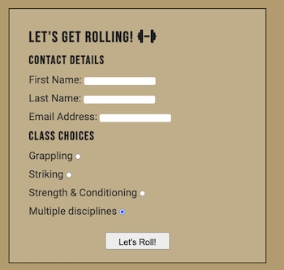

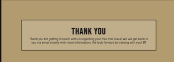

### Responsive flex box reviews which hide/appear depending on screen size
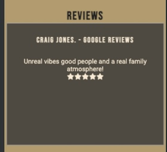
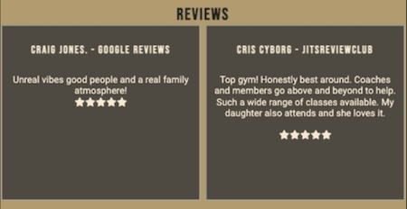
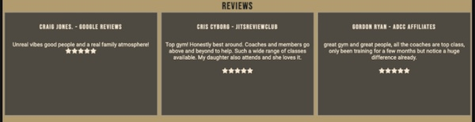

### Youtube video
The embed code was taken from youtube, with adjustments made to styling for it to fit correctly on page.
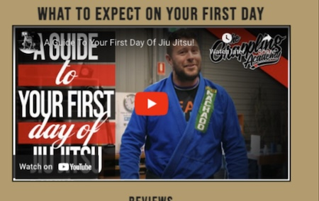

### Working 404 page.
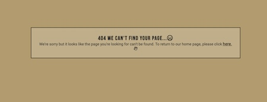

## Features to be Added
I would like to add a feature that would send out an automatic email once a form has been completed letting the end user know that we have received their form submission and will get in touch with them personally while also including an information pack in the email. This could be done by using an API from a company like Twilio, Bird or Mailersend.

A clickable image thread where users can click on an image to open it as a carousel, and scroll through the gallery images by clicking on a toggle, rather than all images being full size.

## Testing

### Validation of Code
Index w3 validator

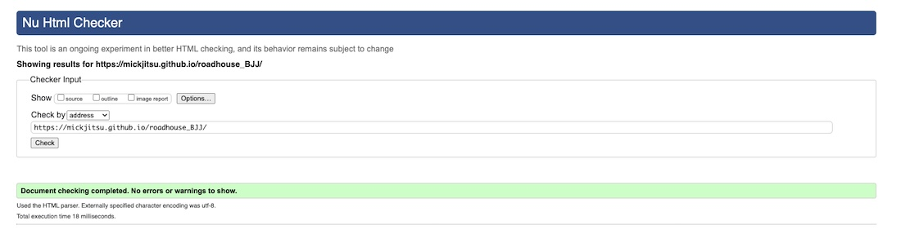

About page w3 validator
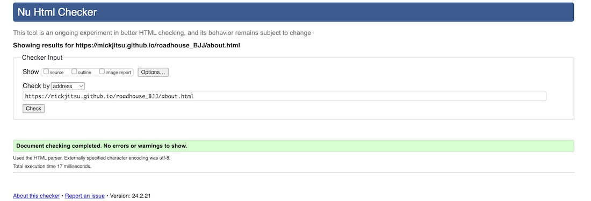

Gallery page w3 validator
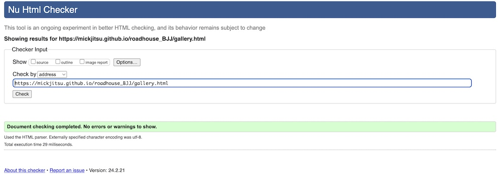

Contact page w3 validator
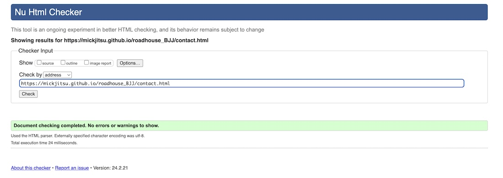

Signed page w3 validator
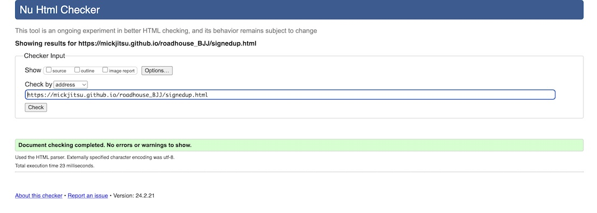
404 page w3 validator
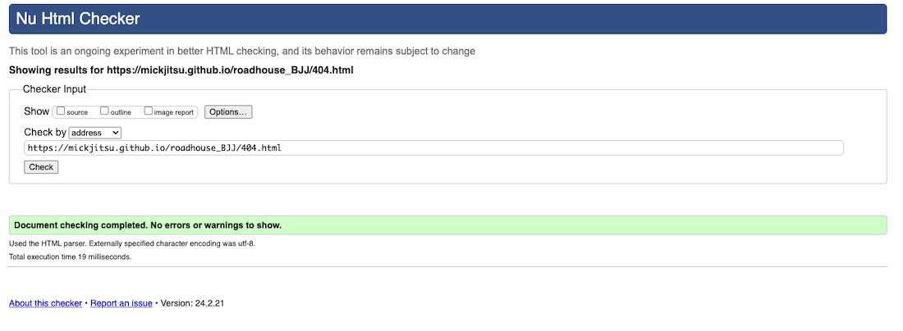

CSS Validator

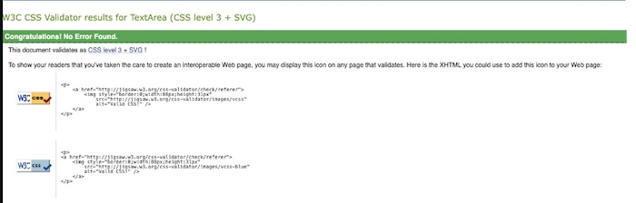

### Lighthouse
Lighthouse results, it's worth noting that at time of testing my internet speed was not great, with a download speed of roughly 7mbps. Best practices score is due to cookies from the embedded google maps location at the bottom of the page.

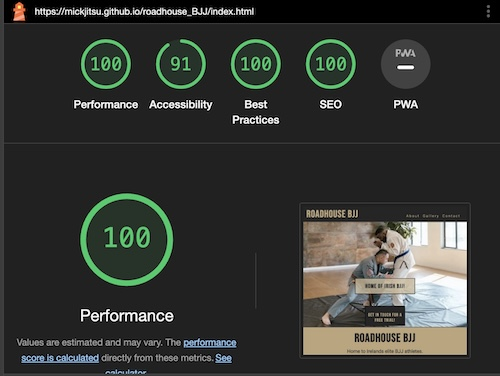

Common issue seems to be with image size and type used for mobile versions of the website. In the future I will procure more modern images suited for web design rather than jpg or png.

### Wave Webaim - accessibility testing
Initially there was one error due to the label tag used for the nav toggle. More information on bug section.
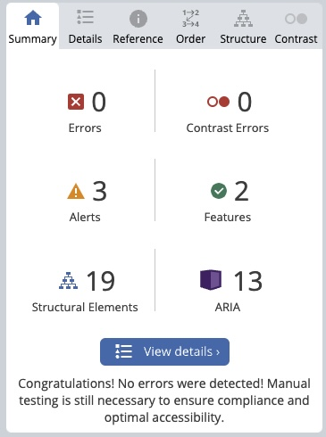

### Manual Testing

Here I have tested all the features on each and every page of my website. Please see the results below.

Our goals were met in this testing as all pages are directly accessible and easy to find for the user, with clear descriptions where to find certain information along with an acknowledgement when a contact form is sent.

This was tested using a google pixel 6 pro, iphone 11 and responsive mode on a large PC monitor.

Format of the table below is as follows:

| Feature being tested| Expected Outcome | Testing Performed | Actual Outcome | Result (Pass or fail) |
| -------------------- | ---------------- | ----------------- | -------------- | --------------------- |
| Header hyperlink index page| Refreshes current page | manually clicked | page refreshed | Result PASS|
| Header hyperlink about page | directs to index page | manually clicked| directed to index page | Result PASS |
| Header hyperlink gallery page | Directs to Index page | manually clicked | Directed to index page | Result PASS |
| Header hyperlink contact page | directs to index page | manually clicked | directed to index page | result PASS |
| Facebook hyperlink on index page| direct to social media sites | manually clicked all | All directed | Result PASS |
| Youtube hyperlink on index page| direct to social media sites | manually clicked all | All directed | Result PASS |
| Instagram hyperlink on index page| direct to social media sites | manually clicked all | All directed | Result PASS |
| Twitter hyperlink on index page| direct to social media sites | manually clicked all | All directed | Result PASS |
| Facebook hyperlink on about page| direct to social media sites  | manually clicked | All Directed | Results PASS |
| Youtube hyperlink on about page| direct to social media sites  | manually clicked | All Directed | Results PASS |
| Instagram hyperlink on about page| direct to social media sites  | manually clicked | All Directed | Results PASS |
| Twitter hyperlink on about page| direct to social media sites  | manually clicked | All Directed | Results PASS |
| Facebook hyperlink on Gallery page| direct to social media sites | manually clicked| All Directed  | Result PASS |
| Youtube hyperlink on Gallery page| direct to social media sites | manually clicked| All Directed  | Result PASS |
| Instagram hyperlink on Gallery page| direct to social media sites | manually clicked| All Directed  | Result PASS |
| Twitter hyperlink on Gallery page| direct to social media sites | manually clicked| All Directed  | Result PASS |
| Facebook hyperlink on contact page| direct to social media sites  | manually clicked | All Directed | Reult PASS |
| Youtube hyperlink on contact page| direct to social media sites  | manually clicked | All Directed | Reult PASS |
| Instagram hyperlink on contact page| direct to social media sites  | manually clicked | All Directed | Reult PASS |
| Twitter hyperlink on contact page| direct to social media sites  | manually clicked | All Directed | Reult PASS |
| Facebook hyperlink on signed-up page| direct to social media sites  | manually clicked | All Directed | Reult PASS |
| Youtube hyperlink on signed-up page| direct to social media sites  | manually clicked | All Directed | Reult PASS |
| Instagram hyperlink on signed-up page| direct to social media sites  | manually clicked | All Directed | Reult PASS |
| Twitter hyperlink on signed-up page| direct to social media sites  | manually clicked | All Directed | Reult PASS |
| Facebook hyperlink on 404 page| direct to social media sites  | manually clicked | All Directed | Reult PASS |
| Youtube hyperlink on 404 page| direct to social media sites  | manually clicked | All Directed | Reult PASS |
| Instagram hyperlink on 404 page| direct to social media sites  | manually clicked | All Directed | Reult PASS |
| Twitter hyperlink on 404 page| direct to social media sites  | manually clicked | All Directed | Reult PASS |
| Dropdown toggle index page| menu drops down and hyperlinks work | manually clicked | menu appears | Result PASS |
| Dropdown toggle about page | menu drops down and hyperlinks work | manually clicked  | menu appears  | Result PASS |
| Dropdown toggle Gallery page| menu drops down and hyperlinks work| manually clicked | menu appears  | Result PASS |
| Dropdown toggle contact page | menu drops down and hyperlinks work| manually clicked  | menu appears | Result PASS  |
| Youtube video about page| Video plays but not automatically | opened about page and clicked play | video only plays when clicked | Result PASS |
| contact form submission required fields | Can't submit form unless all requried fields are checked| Tested every combination | Required fields prompted if not submitted correctly | result PASS |
| contact form submission| redirected to thank you page | completed form and submitted | redireted to signedup.html | Result PASS |

## Bug resolutions

When writing the html and CSS code for this website, some bugs were found and rectified along the way.

A major bug was the stretching of the Hero image on the index.html page. Due to the size of the image being used, on large screens this image would become stretched and off centre.

To fix this, I used a larger version of the same image (900x) and updated the CSS in a media query for screens of 900px and more to use this image, and update the positional values of the image. The CSS used to overcome this bug is shown below.

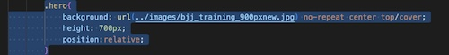

Another bug that was found was on the contact form. The contact form page would submit regardless of whether any class choices or contact information was added or not. This was due to the HTML code for the form not containing a required field. This was amended upon finding the issue when conducting manual testing.

When validating the page using wave, a bug was found due to the label tag being empty in the form that was used to create the navigation toggle as it was done purely using html and css. This was fixed due to help from the documentation below.
https://css-tricks.com/inclusively-hidden/

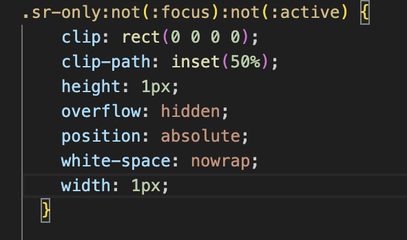

The final bug noticed when creating this website was that the schedule listed in the about page shows as pixelated when testing the responsiveness for smaller screens. This has been tested using 3 different mobile devices however and the image does not appear pixelated, and can be viewed/zoomed in as most images of this type would be on a mobile device.

## Technologies Used

This project was done solely using HTML and CSS, along with vs code and gitpod.

**Cloning the repository**

To clone the repository, you'll need Git installed on your computer. I

Open your terminal or command prompt.
Navigate to the directory where you want to clone the repository.
Run the clone command:

**Forking the repository**

To Fork this repository and have a version of this on your personal account to make changes, customisation and amendments, please do the following.

Go to the GitHub page of the repository : https://github.com/Mickjitsu/roadhouse_BJJ
Click on the "Fork" button, usually found at the top-right corner of the page.

After forking, you will have a copy of the repository in your GitHub account. You can then clone your forked version to your local machine by following the "Cloning the Repository" steps, using the URL of your fork.

To view the repository on the local machine:

1. Navigate to the Project Directory: : cd /roadhouse_BJJ

2. Open the Website: Open the main index.html page in a browser or the folder in a code editory

## Deployment

**Deploying on Github Pages**
Firstly clone or fork the repository following the steps above. Once that is done, you will need to set up GitHub Pages. To do this:
 In your repository, navigate to the "Settings" tab.
   - Click on the "Pages" section on the left sidebar.
   - Under the "Source" section, select the branch you want to deploy from (usually `main` or `master`) and click "Save".
   - GitHub will provide you with a link to your live site.

## Credits

The images of this site came from pexels.com , sherdog.com, bjjfanactics.com and fittinsider.com.

The video came from the grappling academys youtube channel. The schedule was created using Abode.com free schedule maker

## Acknowledgements
I would like to thank my partner for encouraging me to continue on when I was struggling at the start of the course, my family for encouraging me to keep studying despite going through a bereavement, and my mentor Matt for helping me along the way with pre, mid point and final calls!

[Back to top](#introduction)